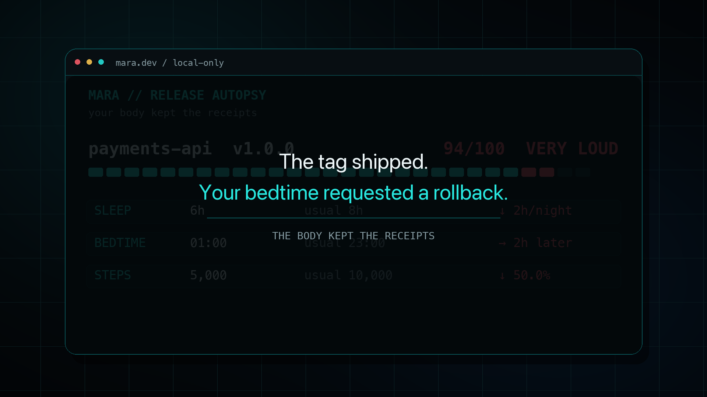

# Mara Release Autopsy

Git remembers when you shipped. Your body does too.

Mara Release Autopsy is a small local CLI that compares Apple Health history with local Git
release tags. It finds the release windows where sleep moved, bedtime slipped, steps dropped, or
resting heart rate changed.

No account. No cloud upload. No telemetry. No LLM. No source-code reading.

## Demo

[](media/mara-release-autopsy-x-linkedin.mp4)

Click the preview to watch the 15-second demo.

## Install

```bash
python3 -m pip install .
```

Install directly from GitHub:

```bash
python3 -m pip install "git+https://github.com/mara-org/mara-release-autopsy.git"
```

## Quick Start

Export Apple Health from the Health app on your iPhone, then point the CLI at the ZIP and one or
more local Git repositories:

```bash
mara-autopsy ~/Downloads/export.zip ~/code/payments-api
mara-autopsy ~/Downloads/export.zip ~/code
```

For the paced terminal reveal:

```bash
mara-autopsy ~/Downloads/export.zip ~/code --show
```

## The Receipt

```text
MARA // RELEASE AUTOPSY
your body kept the receipts

payments-api  v1.0.0                         94/100  VERY LOUD
SLEEP      6h       usual 8h                 ↓ 2h/night
BEDTIME    01:00    usual 23:00              → 2h later
STEPS      5,000    usual 10,000              ↓ 50.0%

The tag shipped. Your bedtime requested a rollback.
```

Interesting timing is not proof. This is not medical advice.

## What It Finds

- Less or more sleep around a release.
- Later or earlier bedtimes.
- Step-count changes.
- Resting-heart-rate changes.
- The loudest release windows inside one Apple Health export.
- A dry Mara verdict when the numbers deserve one.

If a watch, ring, band, or app writes a supported raw metric to Apple Health, the export can carry
that history into the analysis. Proprietary readiness, strain, recovery, and stress scores are not
reconstructed.

## Privacy

- The Apple Health ZIP is streamed in place and never extracted.
- Git is queried for tag names and timestamps. Source files are not opened.
- Reports are generated locally.
- The runtime uses only Python's standard library.

The report is still sensitive. Treat it like the health export itself.

## Output

```bash
mara-autopsy export.zip ~/code --format text
mara-autopsy export.zip ~/code --format markdown --output autopsy-report.md
mara-autopsy export.zip ~/code --format json --output autopsy-report.json
```

Exit codes:

- `0`: at least one sufficiently observed release window was found.
- `1`: no defensible release comparison was available.
- `2`: invalid input, unsafe limits, or another setup error.

## How It Works

For every Git tag inside the available health history, the analyzer:

1. Builds a window ending on release day.
2. Finds prior weekday-matched baseline days.
3. Excludes baseline days close to other releases.
4. Refuses to score metrics with too little data.
5. Compares sleep, bedtime, steps, and resting heart rate.
6. Ranks the sufficiently observed windows from quiet to very loud.

The score ranks release windows inside one export. It is not a health score and must not be
compared between people.

## Scope

Mara Release Autopsy shows association, not causation. Deadlines, travel, illness, family events,
and ordinary life can overlap a release. Git tags are imperfect deployment markers, missing health
data means unknown rather than zero, and sparse history may produce no result. That is a valid
outcome.

## Development

```bash
python3 -m pip install -e ".[dev]"
ruff check .
pytest
```

All tests use synthetic health records and temporary Git repositories. Read
[CONTRIBUTING.md](CONTRIBUTING.md) and [SECURITY.md](SECURITY.md) before contributing.

## About

Maintained by [Mara](https://github.com/mara-org).

Created by [@gqnxx](https://github.com/gqnxx).
